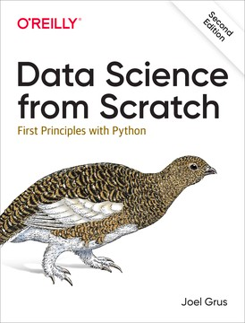
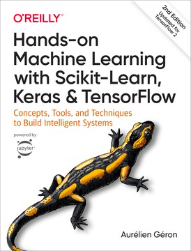
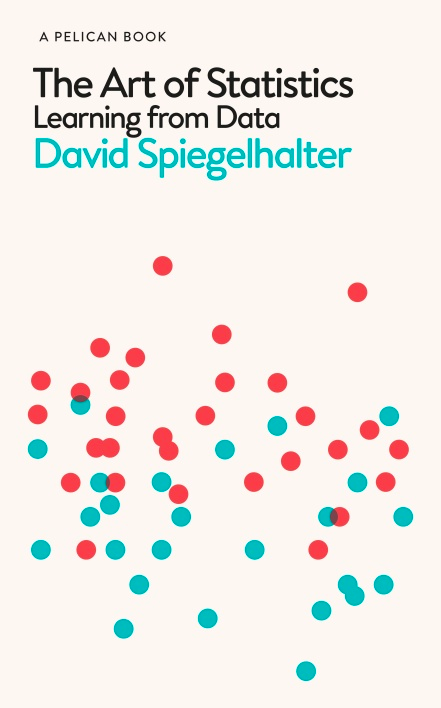
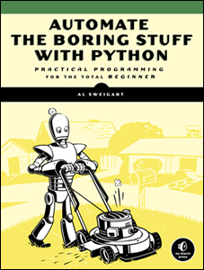
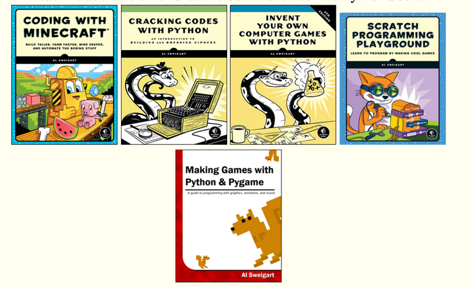
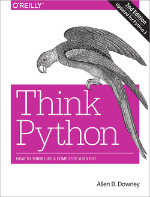

# Useful resources

### Keeping up with the bleeding edge:

[AI Progress Measurement](https://www.eff.org/ai/metrics)

[Papers with Code](https://paperswithcode.com/)

[Tracking the Progress in Natural Language Processing](https://ruder.io/tracking-progress-nlp/)

https://nlpprogress.com/

https://github.com/sebastianruder/NLP-progress

### Videos:

[Deep Learning: A Crash Course](https://www.youtube.com/watch?v=r0Ogt-q956I&t=1868s)

[Machine Learning Zero to Hero (Google I/O'19)](https://www.youtube.com/watch?v=VwVg9jCtqaU)

### Other resources:

The [TensorFlow Tutorials](https://www.tensorflow.org/tutorials) are great, come with jupyter/colab notebooks; you will recognize a some of the code.

The [Kaggle learning center](https://www.kaggle.com/learn/overview) is great.

The [scikit-learn Tutorials](https://scikit-learn.org/stable/tutorial/index.html) page is good, and all of [scikit-learn documentation](https://scikit-learn.org/stable/user_guide.html) is amazing.

The [NLTK manual](https://www.nltk.org/book/) is a good intro to NLP. After that, the [Spacy 101](https://spacy.io/usage/spacy-101) is a good follow up.

The [Pandas manual](https://pandas.pydata.org/pandas-docs/stable/) is a good resource. [10 min to Pandas](https://pandas.pydata.org/pandas-docs/stable/getting_started/10min.html) is a good start.

### Finding help:

Mostly [Stack Overflow](https://stackoverflow.com/). And google...

### Books:

#### My favorite books re: ML and Data Science in 2019

[Github repo](https://github.com/joelgrus/data-science-from-scratch)

https://www.oreilly.com/library/view/data-science-from/9781492041122/

[Github Repo](https://github.com/ageron/handson-ml2)

https://www.oreilly.com/library/view/hands-on-machine-learning/9781492032632/

#### Books about other topics:

**The Art of Statistics**

**Automate the Boring Stuff with Python**

Learn to code while doing useful stuff, or just learn to do the useful stuff:

https://automatetheboringstuff.com/ (free)

(you can also check the other free books from the author)

**Think Python**, a good introduction to "thinking like a programmer": 

https://greenteapress.com/wp/think-python-2e/ (free)

In general, all (free) books from [Green Tea Press](https://greenteapress.com/) are quite good!

[Artificial Inteligence](https://leonardoaraujosantos.gitbooks.io/artificial-inteligence/content/)

